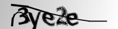
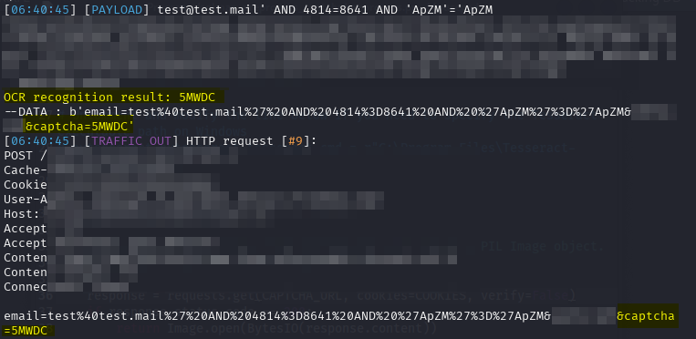

# SQLmap + Preprocess OCR CAPTCHA 工具

使用SQLmap `--preprocess` 參數，搭配 OCR，自動辨識 CAPTCHA 驗證碼，並將結果加到 SQLmap 的 POST 請求中。
支援 Tesseract OCR 或自訓練的 PyTorch 模型進行驗證碼圖片辨識。

📖 [English Documentation](README.md)


---


## 功能

- ✅ **繞過 CAPTCHA**，方便 SQLmap 自動化測試
- ✅ 支援基本 OCR (使用 Tesseract)，例如:  
  
- ✅ 支援進階 OCR (使用自訂 PyTorch 模型 `predict.py`)，例如:  
    
    
  > OCR CAPTCHA 模型訓練工具，可以參考我另一個專案：  
  🔗 [https://github.com/alian613/ocr_captcha](https://github.com/alian613/ocr_captcha)
- ✅ 支援 SQLmap 的 `--preprocess` 參數


---


## 0x00. 環境需求

### 1. Python 3.7+

### 2. [Tesseract OCR](https://github.com/tesseract-ocr/tesseract)
Ubuntu / Kali 安裝方式：
```bash
apt update
apt install tesseract-ocr
```

### 3. 安裝必要的 Python 套件：
```bash
pip install -r requirements.txt
```

若為 Python 3.11+
使用 venv 虛擬環境避免套件安裝問題。
```bash
python -m venv venv
source ./venv/bin/activate
pip install -r requirements.txt
python /usr/share/sqlmap/sqlmap.py -u ... --dbs
```

### （選用）PyTorch 模型辨識
> 如果沒有要使用自訓練的模型辨識，可跳過這一步
- 在 `preprocess_captcha.py` 設定 `USE_PYTORCH = True`
- 確保同目錄有 `predict.py` 檔案，並實作以下函式：
```python
def recognize(image: Image.Image) -> str:
    ...
```
> 範例程式碼詳見：
[https://github.com/alian613/ocr_captcha](https://github.com/alian613/ocr_captcha)


---


## 0x01. 配置說明

在 `preprocess_captcha.py` 內修改以下變數：

```python
CAPTCHA_URL = "https://example.com/captcha"  # 取得 CAPTCHA 圖片的 URL  
USE_PYTORCH = False  # True：使用 PyTorch，自訂模型, False：使用 Tesseract OCR (僅能辨識簡單的 CAPTCHA)
COOKIES = {
"JSESSIONID": "your-session-id-here",  # 與 SQLmap 的 --cookie 參數值保持一致  
}
```


---


## 0x02. SQLmap 使用範例

```bash
sqlmap -u https://target.site/form \
  --data="username=*&action=*" \
  --cookie="JSESSIONID=your-session-id" \
  --preprocess=preprocess_captcha.py \
  -v 6
```
- --data: 填入目標網站的 POST 結構
- --cookie: 需與 preprocess_captcha.py 中設定一致
- -v 6 可查看完整 HTTP traffic，方便 debug



- SQLmap 會在每次發送請求前呼叫 preprocess() 函式，  
  例如：username=testuser&action=submit&captcha=1A2BC


---


## 0x03. 程式流程說明

當 SQLmap 發送請求前，它會執行 preprocess()，自動：
1. 發送請求取得 CAPTCHA 圖片
2. 使用 OCR 辨識圖片中的文字
3. 在 POST data 中插入 `captcha=辨識結果`
範例：`username=test&action=submit&captcha=1A2BC`


---


## Support My Open Source Project

If you appreciate my work, consider ⭐ starring this repository or buying me a coffee to support development.
Your support means a lot to me — thank you!

*** [Ko-fi Support](https://ko-fi.com/alian613) ***

如果你覺得這個專案對你有幫助，歡迎給個 ⭐，也歡迎請我喝杯咖啡，非常感謝 ~


---


## 📄 License

This project is licensed under the MIT License.

---

## Disclaimer

This script is intended for educational and ethical penetration testing purposes only.  
Do **not** use it against systems you do not have explicit permission to test.

本程式僅供教育用途及合法授權的滲透測試使用，  
旨在促進資安環境的改善與提升安全性，  
請勿用於未經授權的系統或任何非法行為。